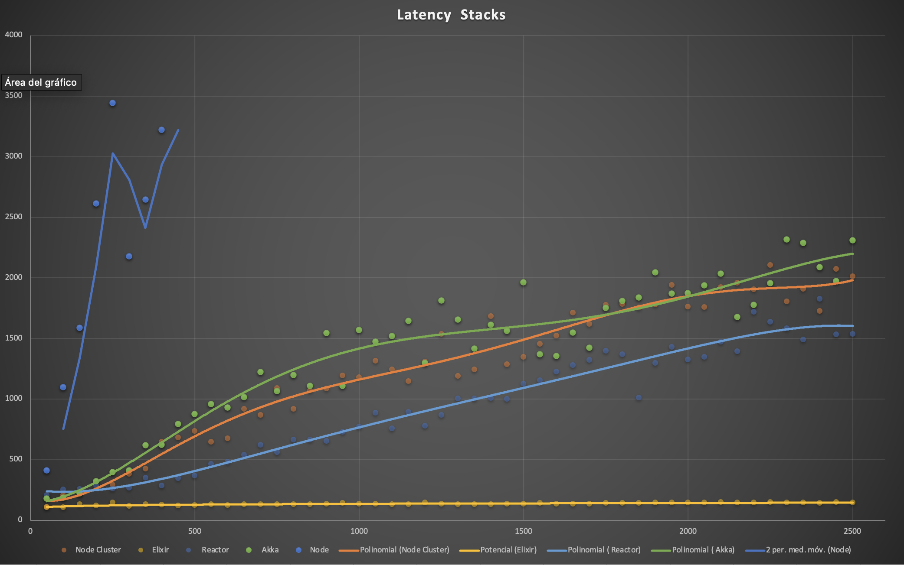
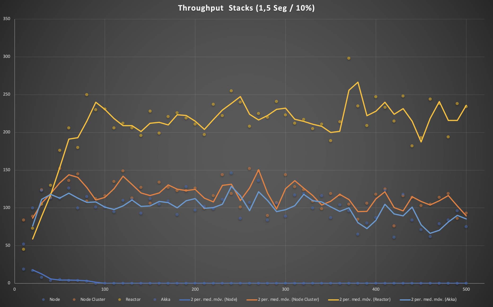

# Performance Analyzer

[![MIT License][license-shield]][license-url]
[![Docker Hub][docker-shield]][docker-url]
[![Contributors][contributors-shield]][contributors-url]
[![Forks][forks-shield]][forks-url]
[![Stars][stars-shield]][stars-url]
[![Issues][issues-shield]][issues-url]
[![semantic-release: angular][semantic-release-url-badge]][semantic-release-url]


[![Quality Gate Status][sonarcloud-quality-gate-shield]][sonarcloud-url]
[![Maintainability Rating][sonarcloud-maintainability-shield]][sonarcloud-url]
[![GitHub Actions - Build][build-shield]][build-url]
[![GitHub Actions - Release][release-shield]][release-url]

[//]: # ([![Score Cards][scorecards-shield]][scorecards-url])


Performance Analyzer is an HTTP benchmarking tool capable of generating significant load from a single node or from a
distributed cluster. It combines the capabilities of elixir to analyze the behavior of an application in different
concurrency scenarios.

- [Performance Analyzer](#performance-analyzer)
    - [Install](#install)
    - [Basic Usage](#basic-usage)
    - [Run](#run)
    - [Results](#results)
        - [Examples](#examples)

## Install

```shell
mix do local.hex --force, local.rebar --force
mix do deps.clean --unused, deps.get, deps.compile
mix compile
```

## Basic Usage

Open and edit config/performance.exs file to configure.

```elixir
import Config

config :distributed_performance_analyzer,
  url: "http://httpbin.org/get",
  request: %{
    method: "GET",
    headers: [{"Content-Type", "application/json"}],
    # body: ~s|'{"data": "value"}'| --> If you don't use dataset values
    body: fn item ->
      # This is for dataset replacement
      ~s|'{"data": #{Enum.random(1..10)}, "key": "#{item.columnName}"}'|
    end
  },
  execution: %{
    steps: 5,
    increment: 1,
    duration: 2000,
    constant_load: false,
    dataset: "/Users/sample.csv",
    # dataset: :none, --> If you don't use dataset
    separator: ","
  },
  distributed: :none,
  jmeter_report: true

config :logger,
  level: :info

```

| Property      | Description                                                                                                                |
|---------------|----------------------------------------------------------------------------------------------------------------------------|
| url           | The url of the application you want to test. Make sure you have a network connection between two machines                  |
| request       | Here you need to configure the HTTP verb, headers and the body of the request.                                             |
| steps         | The number of executions for the test. Each step adds the concurrency configured in the increment                          |
| increment     | Increment in concurrency after each step                                                                                   |
| duration      | Duration in milliseconds of each step                                                                                      |
| constant_load | Allows you to configure if the load will be constant or if the increment will be used to vary the concurrency in each step |
| dataset       | The path to the csv dataset file                                                                                           |
| separator     | Dataset separator (, ; :)                                                                                                  |
| distributed   | Indicates if it should be run from a single node or in a distributed way                                                   |
| jmeter report | Generates jmeter csv style report?                                                                                         |

In the example above will be executed a test of 5 steps with an increment of 50:

1. Step 1: 50 of concurrency
2. Step 2: 100 of concurrency
3. Step 3: 150 of concurrency
4. ...

Each step will last 2 seconds.

## Run

Docker:

https://hub.docker.com/r/bancolombia/distributed-performance-analyzer

```shell
docker run --rm -v <project_path>/config:/home/dpa/config -v <project_path>/dataset:/home/dpa/datasets bancolombia/distributed-performance-analyzer:latest
```

In the shell:

```shell
iex -S mix
or
iex --sname node1@localhost -S mix
```

To run IEX Execution:

```elixir
alias DistributedPerformanceAnalyzer.Domain.UseCase.ExecutionUseCase
ExecutionUseCase.launch_execution()
```

Elixir Release:

```shell
mix release
_build/prod/rel/distributed_performance_analyzer/bin/distributed_performance_analyzer start
```

## Results

After each step is executed you will get a table of results like the following:

CSV format:

```csv
concurrency, throughput, min latency (ms), mean latency (ms), max latency (ms), p90 latency (ms), p95 latency (ms), p99 latency (ms), http_mean_latency, http_max_latency, 2xx requests, 3xx requests, 4xx requests, 5xx requests, http_errors, total_errors, total_requests
1, 4.0, 27, 49.0, 71, 66.6, 68.8, 70.56, 49.0, 71, 2, 0, 0, 0, 0, 0, 2
2, 116.0, 12, 17.0, 33, 22.3, 24.0, 33.0, 17.0, 33, 58, 0, 0, 0, 0, 0, 58
3, 156.0, 12, 18.44, 28, 24.3, 25.15, 27.23, 18.44, 28, 78, 0, 0, 0, 0, 0, 78
4, 178.0, 12, 21.39, 50, 27.2, 47.0, 49.12, 21.39, 50, 89, 0, 0, 0, 0, 0, 89
5, 294.0, 12, 16.52, 32, 22.0, 24.4, 31.54, 16.52, 32, 147, 0, 0, 0, 0, 0, 147

```

JMeter format:

```csv
timeStamp,elapsed,label,responseCode,responseMessage,threadName,dataType,success,failureMessage,bytes,sentBytes,grpThreads,allThreads,URL,Latency,IdleTime,Connect
1694523851175,71,sample,200,OK,#PID<0.443.0>,,true,,24,0,1,1,GET -> http://localhost:8080/wait/10,70,0.0,400
1694523851246,27,sample,200,OK,#PID<0.443.0>,,true,,24,0,1,1,GET -> http://localhost:8080/wait/10,27,0.0,2
1694523851317,15,sample,200,OK,#PID<0.443.0>,,true,,24,0,2,2,GET -> http://localhost:8080/wait/10,15,0.0,0
1694523851317,15,sample,200,OK,#PID<0.444.0>,,true,,24,0,2,2,GET -> http://localhost:8080/wait/10,15,0.0,400
1694523851332,22,sample,200,OK,#PID<0.443.0>,,true,,24,0,2,2,GET -> http://localhost:8080/wait/10,22,0.0,0
1694523851332,22,sample,200,OK,#PID<0.444.0>,,true,,24,0,2,2,GET -> http://localhost:8080/wait/10,22,0.0,0
1694523851354,17,sample,200,OK,#PID<0.443.0>,,true,,24,0,2,2,GET -> http://localhost:8080/wait/10,17,0.0,0
1694523851354,17,sample,200,OK,#PID<0.444.0>,,true,,24,0,2,2,GET -> http://localhost:8080/wait/10,17,0.0,0
1694523851371,20,sample,200,OK,#PID<0.443.0>,,true,,24,0,2,2,GET -> http://localhost:8080/wait/10,20,0.0,0
1694523851371,20,sample,200,OK,#PID<0.444.0>,,true,,24,0,2,2,GET -> http://localhost:8080/wait/10,20,0.0,0
```

Then, you can compare the attributes that are interesting for you. For example concurrency vs Throughput or Concurrency
vs Mean Latency.

### Examples






[semantic-release-url-badge]: https://img.shields.io/badge/semantic--release-angular-e10079?logo=semantic-release
[semantic-release-url]: https://github.com/semantic-release/semantic-release
[scorecards-shield]: https://github.com/bancolombia/distributed-performance-analyzer/actions/workflows/scorecards-analysis.yml/badge.svg
[scorecards-url]: https://github.com/bancolombia/distributed-performance-analyzer/actions/workflows/scorecards-analysis.yml
[docker-shield]: https://img.shields.io/docker/pulls/bancolombia/distributed-performance-analyzer
[docker-url]: https://hub.docker.com/repository/docker/bancolombia/distributed-performance-analyzer
[contributors-shield]: https://img.shields.io/github/contributors/bancolombia/distributed-performance-analyzer.svg
[contributors-url]: https://github.com/bancolombia/distributed-performance-analyzer/graphs/contributors
[forks-shield]: https://img.shields.io/github/forks/bancolombia/distributed-performance-analyzer.svg
[forks-url]: https://github.com/bancolombia/distributed-performance-analyzer/network/members
[stars-shield]: https://img.shields.io/github/stars/bancolombia/distributed-performance-analyzer.svg
[stars-url]: https://github.com/bancolombia/distributed-performance-analyzer/stargazers
[issues-shield]: https://img.shields.io/github/issues/bancolombia/distributed-performance-analyzer.svg
[issues-url]: https://github.com/bancolombia/distributed-performance-analyzer/issues
[license-shield]: https://img.shields.io/github/license/bancolombia/distributed-performance-analyzer.svg
[license-url]: https://github.com/bancolombia/distributed-performance-analyzer/blob/main/LICENSE
[sonarcloud-url]: https://sonarcloud.io/dashboard?id=bancolombia_distributed-performance-analyzer
[build-url]: https://github.com/bancolombia/distributed-performance-analyzer/actions/workflows/build.yml
[build-shield]: https://github.com/bancolombia/distributed-performance-analyzer/actions/workflows/build.yml/badge.svg
[release-url]: https://github.com/bancolombia/distributed-performance-analyzer/actions/workflows/release.yml
[release-shield]: https://github.com/bancolombia/distributed-performance-analyzer/actions/workflows/release.yml/badge.svg
[sonarcloud-quality-gate-shield]: https://sonarcloud.io/api/project_badges/measure?project=bancolombia_distributed-performance-analyzer&metric=alert_status
[sonarcloud-maintainability-shield]: https://sonarcloud.io/api/project_badges/measure?project=bancolombia_distributed-performance-analyzer&metric=sqale_rating
